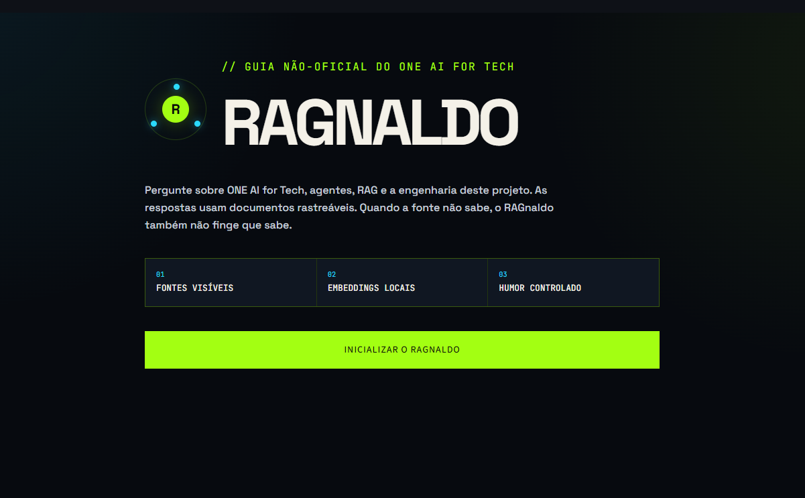
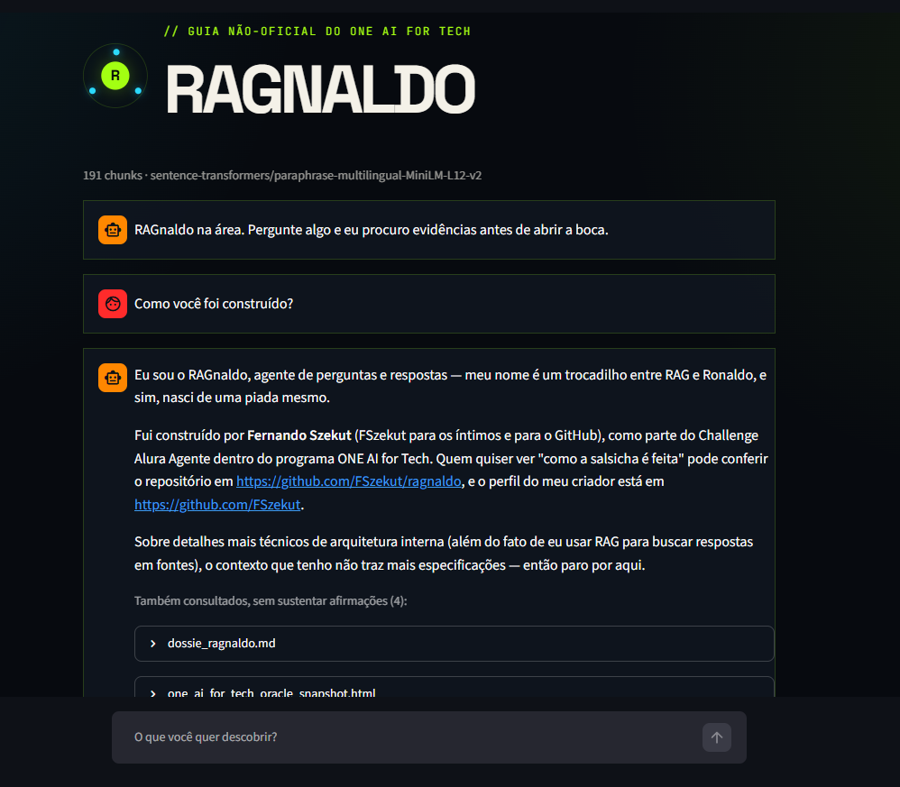

# RAGnaldo

> Um guia inteligente e bem-humorado sobre o ONE AI for Tech e a própria engenharia por trás deste agente.

### ▶ [Acesse a aplicação](https://ragnaldo-gh5wfcwbpa-rj.a.run.app)

O RAGnaldo é o projeto desenvolvido para o Challenge Alura Agente. Ele usa RAG para responder perguntas com base em documentos públicos e em documentação autoral do projeto, sempre apresentando as fontes recuperadas, e recusando quando elas não sustentam a resposta.



A captura mantém a barra de endereços à mostra (`ragnaldo-gh5wfcwbpa-rj.a.run.app`) porque uma imagem de aplicação Streamlit sem a URL não distingue nuvem de `localhost`. A landing carrega sem importar torch, sentence-transformers, LangChain ou FAISS. Esses recursos só entram em memória quando o visitante inicializa o agente.



Uma resposta em produção: o agente se apresenta, cita a fonte que sustenta cada afirmação e declara explicitamente o que o contexto não cobre, dizendo "sobre detalhes mais técnicos de arquitetura interna, o contexto que tenho não traz mais especificações, então paro por aqui". Abaixo da resposta ficam os trechos consultados que não sustentaram nada.

## Status

✅ **Em produção.** Ingestão multiformato, índice vetorial verificado, recuperação com corte de evidência, geração fundamentada e deploy automático no Cloud Run funcionando de ponta a ponta. Desde 11/08 o fluxo de decisão é um grafo de estados em **LangGraph**, com ciclo de reescrita da pergunta antes de recusar. As decisões estão registradas em [`diretrizes.md`](diretrizes.md).

## Arquitetura

```text
Ingestão (offline, sem custo de API)
PDF DOCX XLSX PPTX MD TXT CSV JSON HTML
    -> tabela LOADERS -> chunks -> embeddings locais -> FAISS + manifesto de hashes

Serving (grafo de estados, LangGraph)

  START
    |
    v
  recuperar_evidencia <-----------------------------+
    |                                               |
    |  rotear()                                     |
    +-- há evidência ...> gerar ...> resposta + fontes -> END
    |                                               |
    +-- 1a falha .......> reescrever                |
    |                       |                       |
    |                       |  houve_mudanca()      |
    |                       +-- texto mudou ........+  2a passada, corte 1,25
    |                       +-- texto idêntico ...> recusar -> END
    |
    +-- 2a falha .....................................> recusar -> END
```

Os embeddings são locais em todas as etapas, inclusive para a pergunta. A API do modelo gerador é chamada **uma vez** quando existe evidência, e **uma vez** quando a pergunta precisa ser reescrita.

### Por que grafo no lugar da chain

Até 10/08 o serving era uma chain LCEL linear. Ela expressava bem o caminho feliz e escondia a decisão que mais importa neste projeto: recusar antes de gastar uma chamada cara. Pior, ela não tinha como expressar a aresta de volta.

O ciclo de reescrita precisa que `reescrever` retorne para `recuperar_evidencia`, e chain linear não faz volta. Foi isso que motivou a migração, não a vontade de usar a biblioteca. O commit que abriu a branch registra a frase: *"o fluxo de decisão vira grafo, e langgraph deixa de ser fantasma"*.

O que o grafo tem, em [`src/ragnaldo/graph.py`](src/ragnaldo/graph.py):

| | |
|---|---|
| **Estado** | `RagState`, um `TypedDict` com `question`, `evidence`, `descartados`, `answer`, `error` e `reescrita` |
| **Nós** | `recuperar_evidencia`, `reescrever`, `recusar`, `gerar` |
| **Arestas condicionais** | `rotear()` depois da recuperação, `houve_mudanca()` depois da reescrita |
| **Ciclo** | `reescrever` volta para `recuperar_evidencia` quando o texto mudou |

Duas consequências que valem mais que o desenho. A recusa por falta de lastro passou a ser uma aresta do grafo, visível para quem lê o código, em vez de um tratamento colado depois da resposta. E a segunda passada usa um corte mais exigente, `rewrite_best_max` em **1,25** contra os **1,35** da primeira: a reescrita já teve a chance de otimizar a formulação, então exigir o mesmo limiar deixaria uma pergunta ruim entrar por insistência.

Cronômetro e registro de execução ficam fora do grafo, em `answer_question`, porque instrumentam a execução sem fazer parte do domínio.

## Estrutura

```text
ragnaldo/
├── notebooks/       # aprendizado, experimentos e evolução do RAG
├── src/ragnaldo/     # componentes reutilizáveis estabilizados
├── app/              # aplicação Streamlit
├── data/raw/         # documentos-fonte não sensíveis
├── data/processed/   # conteúdo intermediário reproduzível
├── artifacts/        # índice vetorial e metadados gerados
├── tests/            # testes automatizados
├── docs/             # documentação e evidências
├── infrastructure/   # Docker, Cloud Run e CI/CD
└── assets/           # imagens e recursos visuais
```

## Preparação local

```bash
python3 -m venv env
source env/bin/activate
python -m pip install torch --index-url https://download.pytorch.org/whl/cpu
python -m pip install -r requirements.txt
python -m ipykernel install --sys-prefix --name ragnaldo --display-name "Python (RAGnaldo)"
```

## Configuração do modelo gerador

```bash
cp .env.example .env
```

Preencha com o provedor, o modelo e a chave. O `.env` é ignorado pelo Git:

```
LLM_PROVIDER=anthropic
LLM_MODEL=claude-sonnet-5
LLM_API_KEY=sk-ant-...
```

Opcionais, todos com padrão razoável: `LLM_MAX_TOKENS` (1024), `RETRIEVAL_K` (10), `RETRIEVAL_BEST_MAX` (1.35), `RETRIEVAL_RELATIVE_MARGIN` (0.25) e `RETRIEVAL_MIN_EVIDENCE` (4). O `LLM_TEMPERATURE` só deve ser definido se o modelo escolhido aceitar o parâmetro: os mais recentes o rejeitam com HTTP 400.

## Exemplos

### Pergunta dentro do corpus

> **O que o ONE AI for Tech ensina sobre RAG e LangChain?**
>
> O ONE AI for Tech aborda esses temas na frente "Engenharia de IA e RAG com LangChain". Segundo o contexto, os pontos ensinados são LangChain e orquestração de LLMs, RAG para buscar informação em documentos reduzindo alucinações, e RAG avançado com chunking, embeddings, bancos vetoriais, reescrita de perguntas e avaliação de qualidade. (…)
>
> `(Fonte: one_ai_for_tech_oracle_snapshot.html)`

A resposta citou duas fontes. Outros trechos entraram no contexto mas não sustentavam nenhuma afirmação, e o modelo os descartou em vez de costurá-los ao texto. Latência de 6,9 s.

### Pergunta fora do corpus

> **Qual foi o placar da final da Copa do Mundo de 1970?**
>
> Não encontrei isso nas fontes que eu tenho. Poderia inventar, mas o jurídico vetorial não deixou.

A busca devolveu dez resultados, como sempre devolve. O melhor ficou a 1,450, longe demais para sustentar qualquer coisa, e nenhum virou contexto.

Aí o agente não recusa de imediato: ele **reescreve a pergunta e tenta de novo**. Se a reescrita voltar igual à original, a segunda busca daria o mesmo resultado, e é isso que autoriza a recusa. Medido em 11/08, sobre cinco perguntas fora do corpus: **recusa em 933 ms na média** (624 ms a 1.241 ms), com **uma chamada de modelo**, a da reescrita. Para efeito de comparação, uma resposta fundamentada leva cerca de 9 segundos.

O sinal de "fora de escopo" é o texto voltar idêntico, e isso é pedido explicitamente ao modelo: a regra 4 do prompt de reescrita manda devolver a pergunta palavra por palavra quando ela não é sobre o acervo. Sem essa regra o prompt puxaria a pergunta de fora para o vocabulário de dentro, a segunda busca traria um documento marginal, e o agente responderia onde deveria recusar. Medição da regra: **5 de 5** perguntas fora do corpus voltaram idênticas, e **3 de 3** perguntas legítimas continuaram sendo reescritas ("vale a pena fazer o ONE?" vira "Quais são os benefícios do ONE AI for Tech?").

> ⚠️ **Corrigido em 11/08.** Este trecho afirmava que a recusa saía em "19 ms sem chamar a API". Era verdade na chain linear e deixou de ser quando o ciclo de reescrita entrou. O número antigo sobreviveu porque ninguém remede o que já está escrito.

## Corte de evidência

A busca sempre retorna `k` resultados: para uma pergunta sobre algo ausente do corpus, ela devolve os menos ruins, não os bons. O que decide se existe resposta é o corte, em três estágios:

1. **o melhor resultado precisa estar abaixo de `best_max` (1,35)**, que é o que separa "o corpus trata desse assunto" de "não trata";
2. **os demais entram se ficarem dentro de `relative_margin` (0,25) do melhor**, o que se adapta à escala de cada pergunta;
3. **pelo menos `min_evidence` (4) trechos são enviados** quando os dois primeiros estágios deixam menos.

O terceiro estágio corrige um efeito colateral do segundo: quando um trecho é muito melhor que os demais, a margem descarta todo o resto e sobra ele sozinho. Como o texto é dividido a cada mil caracteres, esse trecho isolado costuma ser metade de uma seção. O modelo então responde, com razão, que a informação "foi cortada antes de detalhar", enquanto a continuação estava no chunk seguinte.

O segundo estágio existe porque a distância não é comparável entre perguntas. "O que o ONE ensina sobre RAG e LangChain?" produz 0,71; "para quem é o programa ONE?", sobre o mesmo corpus, produz 1,16. Um limiar absoluto único rejeitaria a segunda ou aceitaria qualquer coisa na primeira. Foi exatamente o que aconteceu na primeira calibração deste projeto, feita com uma única pergunta de exemplo.

O corte decide se **há assunto**, não se há resposta. Perguntas com vocabulário sobreposto ao corpus passam de propósito, e quem recusa ali é o modelo, que recebe o contexto e vê que ele trata de outra coisa.

## Avaliação

```bash
python scripts/eval_retrieval.py
```

Vinte e três perguntas com expectativa declarada: dezoito que o corpus responde (várias em linguagem coloquial, que é onde a recuperação falhava, e outras sobre a própria identidade e os próprios limites do agente) e cinco que ele não responde. O script falha se a calibração regredir.

Isso não é teste unitário e não pode ser: nos dois modos de falha de um RAG (silêncio indevido e resposta indevida) o código está correto. O que está errado é a calibração, e ela só aparece executando perguntas contra o índice real.

## Registro de execução

Cada pergunta gera uma linha em `artifacts/logs/execution.jsonl` com timestamp, pergunta, resposta, trechos recuperados com suas distâncias, latência, modelo e eventual erro. O arquivo fica fora do Git porque contém as perguntas reais de quem usa o agente.

Uma linha real, com a resposta abreviada e a lista de trechos reduzida a três:

```json
{
  "timestamp": "2026-08-03T00:35:17.376605+00:00",
  "question": "voce utiliza alguma tecnologia oracle?",
  "answer": "Não encontrei no contexto nenhuma informação sobre as tecnologias usadas na minha…",
  "refused": false,
  "model": "claude-sonnet-5",
  "latency_ms": 4176,
  "retrieved": [
    {"source": "oracle_ai_insights_america_latina_2025.pdf", "location": "página 29", "chunk_id": "d6ac22530f351ae7", "distance": 0.665},
    {"source": "one_ai_for_tech_oracle_snapshot.html", "location": "documento", "chunk_id": "649e6935ef13451e", "distance": 0.7728},
    {"source": "fontes_e_licencas.md", "location": "documento", "chunk_id": "bdcf6368cf54624d", "distance": 0.8159}
  ],
  "error": null
}
```

Esse caso mostra a divisão de trabalho descrita acima. `refused` é `false` porque o corte de evidência deixou passar: o corpus fala bastante de Oracle, e a menor distância foi 0,665. Quem recusou foi o modelo, ao ver que os trechos tratavam da Oracle no mercado latino-americano, não das tecnologias com que este agente foi construído. O corte responde "há assunto?"; a pergunta "há resposta?" é do modelo.

## Fontes

Baixe as fontes públicas registradas no manifesto:

```bash
python scripts/download_sources.py
```

Arquivos de terceiros permanecem fora do Git. URLs, hashes e status temporal estão em [`data/sources.json`](data/sources.json). A documentação de procedência está em [`docs/sources/fontes_e_licencas.md`](docs/sources/fontes_e_licencas.md).

## Notebooks

```bash
jupyter lab
```

Execute primeiro `01_ingestao_e_embeddings.ipynb` para gerar o índice. Depois `02_retrieval_e_rag.ipynb`, que percorre a recuperação, o corte de evidência, o prompt e a cadeia completa. Termina no teste que mais importa: uma pergunta que o corpus não responde.

## Interface

```bash
streamlit run app/main.py
```

A landing page é carregada sem importar torch, sentence-transformers, LangChain ou FAISS. Esses recursos entram em memória apenas quando o usuário inicializa o agente. Durante a primeira carga, a interface exibe uma animação com suporte a `prefers-reduced-motion`.

Abaixo de cada resposta ficam os trechos consultados, com fonte e localização. Eles são rotulados como consultados, não como citados: todos foram ao contexto do modelo, mas a resposta pode ter descartado os que não sustentavam nenhuma afirmação.

## Deploy

Cada push na `main` dispara `.github/workflows/deploy.yml`, que executa:

```text
testes e lint
    -> baixa os documentos do OCI Object Storage
    -> gera o índice vetorial
    -> avalia a recuperação   <- barra o deploy se a calibração regredir
    -> constrói a imagem e envia ao Artifact Registry
    -> publica no Cloud Run
```

O índice é construído no pipeline, não empacotado no repositório: os documentos-fonte são de terceiros e ficam fora do Git, e quem os guarda é o **OCI Object Storage**. É esse passo que atende ao requisito de usar ao menos um serviço OCI. Ele não é decorativo, porque sem o bucket o pipeline não teria as fontes para indexar.

A autenticação no GCP usa **Workload Identity Federation**: o GitHub emite um token de curta duração a cada execução e o Google o troca por credenciais temporárias. Nenhuma chave de conta de serviço existe como segredo. A chave da API do modelo fica no Secret Manager e é lida pelo Cloud Run em tempo de execução, nunca entrando na imagem.

A preparação da infraestrutura está em [`infrastructure/SETUP.md`](infrastructure/SETUP.md).

## Evidência de execução em nuvem

| | |
|---|---|
| **Aplicação** | <https://ragnaldo-gh5wfcwbpa-rj.a.run.app> |
| **Repositório** | <https://github.com/FSzekut/ragnaldo> |
| **Hospedagem** | Google Cloud Run, região `southamerica-east1` |
| **Serviço OCI** | OCI Object Storage, bucket dos documentos-fonte |
| **Capturas** | [`assets/landing.png`](assets/landing.png) · [`assets/agente-respondendo.png`](assets/agente-respondendo.png) |

As duas imagens no topo deste documento foram capturadas da aplicação em execução no Cloud Run, não de ambiente local. A primeira preserva a barra de endereços com o domínio `run.app`, que é o que torna a evidência verificável em vez de apenas afirmada.

Cada pergunta respondida em produção gera uma linha em `artifacts/logs/execution.jsonl` com timestamp, trechos recuperados, distâncias, latência e modelo. O formato está exemplificado em [Registro de execução](#registro-de-execução).

### Onde cada requisito obrigatório foi cumprido

| Requisito do enunciado | Onde |
|---|---|
| Repositório público no GitHub | <https://github.com/FSzekut/ragnaldo> |
| Ao menos um serviço OCI no deploy | OCI Object Storage guarda os documentos-fonte; o pipeline os baixa antes de indexar, em `.github/workflows/deploy.yml` |
| Imagem ou vídeo do agente executando em nuvem | As duas capturas acima, com a URL do Cloud Run visível |
| Registro da execução (card 8) | `artifacts/logs/execution.jsonl`, com pergunta, contexto recuperado, resposta, timestamp e latência |

## Segurança antes de commits

Depois de revisar e adicionar os arquivos desejados ao staging:

```bash
python scripts/security_check.py
python -m pip check
python -m pip_audit
pytest
ruff check .
git diff --cached
```

O commit só deve ser criado depois que essas verificações passarem. O `security_check.py` também está instalado como hook de `pre-commit`, e o repositório tem push protection ativo no GitHub.
